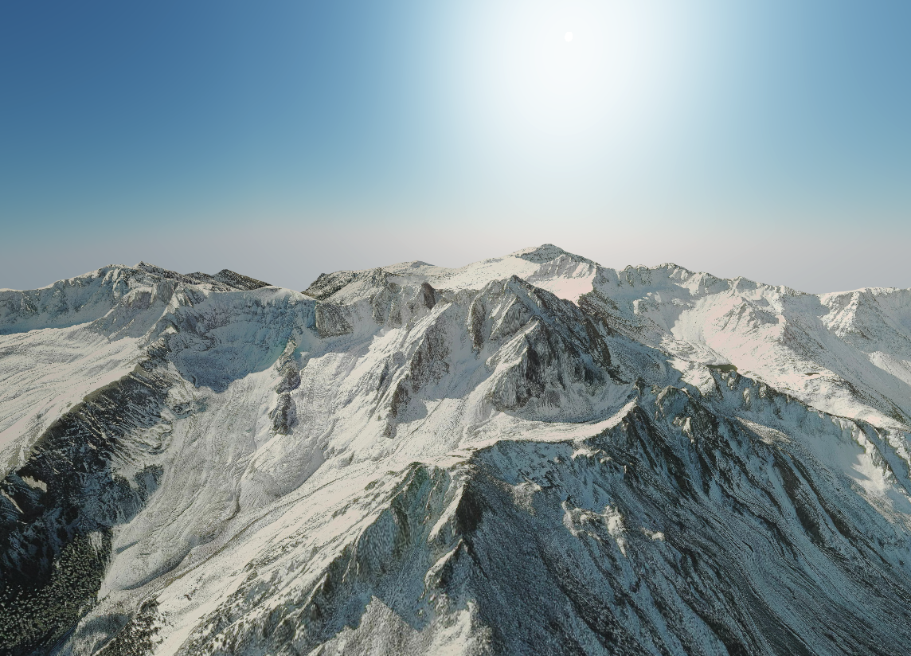

# TerraFirma.js

This is a library for rendering 3D maps from geoJSON pbjects. It is not a slippy map renderer and only generates a specific area. It supports drawing lines and markers on the map, as well as some basic animations.

Its great for visualizing hiking trails and could be a cool way to display them in a blog.

Currently it only supports mapbox tiles but I would like to possibly add more. DISCLAIMER: it can be fairly heavy on tile requests if you try to generate to large of an area.

Built with THREE.js and turf.js

Note: still trying to figure out how NPM works once I figure that out it will be available there.

## Basic usage

```js
import TerraFirma from 'terra-firma'

// Define a geoJSON Feature. Can be anything but keep in
// mind the result will always be reqtangular. This is just
// telling it what area you want it to generate for.
let polygon = {
    "type": "Feature",
    "properties": {},
    "geometry": {
        "type": "Polygon",
        "coordinates": [
            [
                [-107.810905, 38.014829],
                [-107.810905, 37.975056],
                [-107.758338, 37.975056],
                [-107.758338, 38.014829],
                [-107.810905, 38.014829]
            ]
        ]
    }
}


window.addEventListener('DOMContentLoaded', (event) => {

  let mapElemenat = document.getElementById('map')

  let map3d = new TerraFirma({
    element: mapElemenat,
    feature: polygon,
    buffer: 10, // extra tile area outside main feature to render.
    bufferUnit: 'meters', // unit of measure for buffer. Ex. meters miles feet
    resolutionMultiple: 1, // Allows you to render higher res satallite tiles. Will slow things down a lot.
    apiToken: "Your Mapbox Key here"
  })

})


```

This will output a rendering like.



To point the camera to a new center
```
map3d.focusOn(geojsonPoint)
```

To add a marker
```
map3d.drawMarker(geojsonPoint)
```

And to draw a linestring
```
map3d.drawLine(linstring)
```

Inputs are all geojson types.
